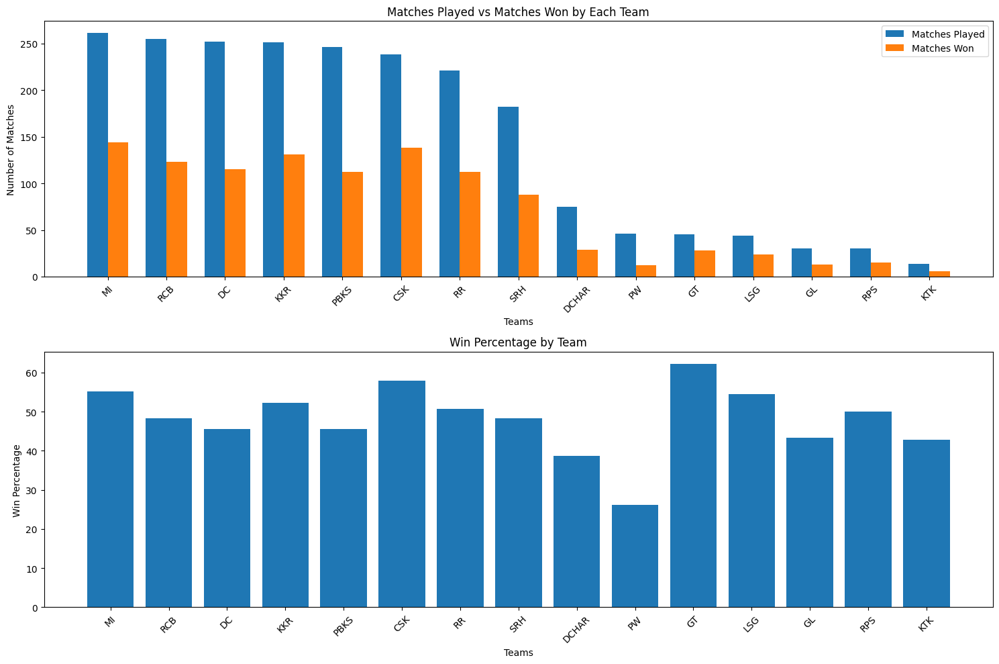
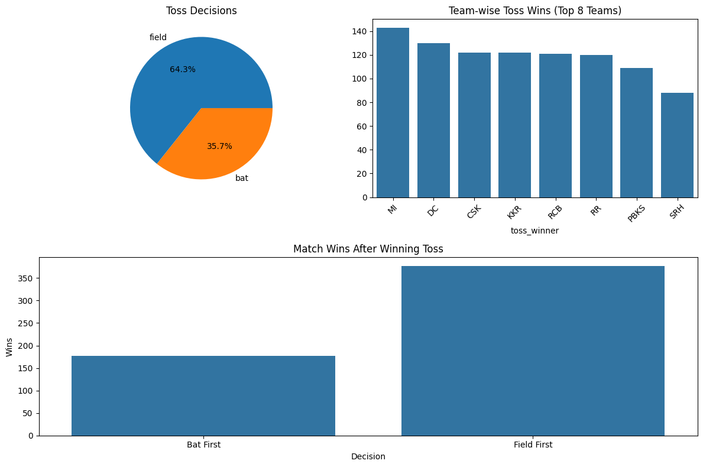
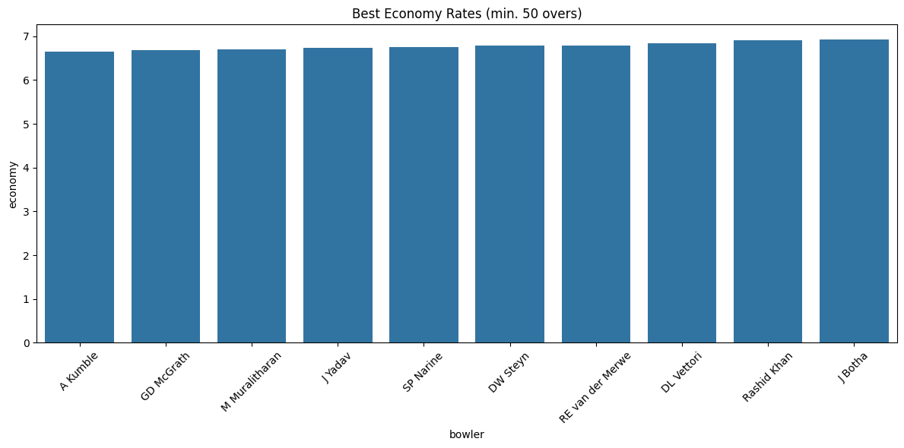
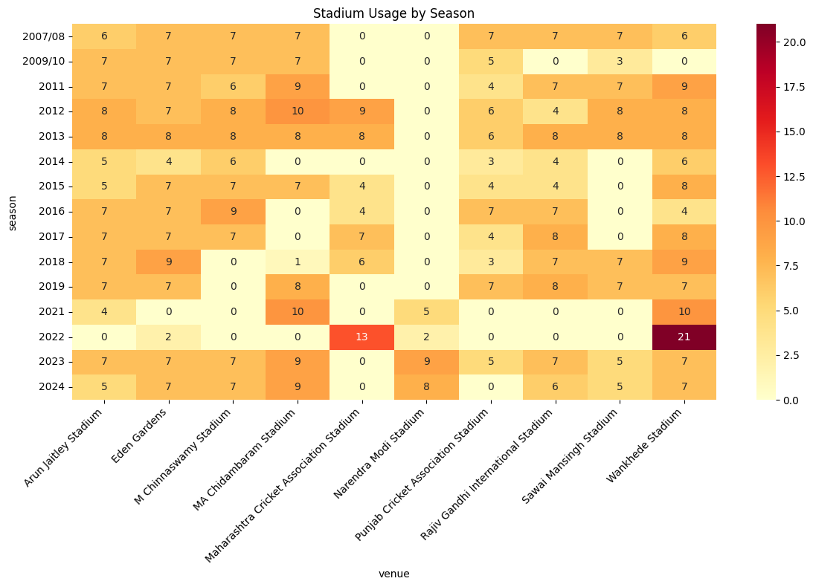
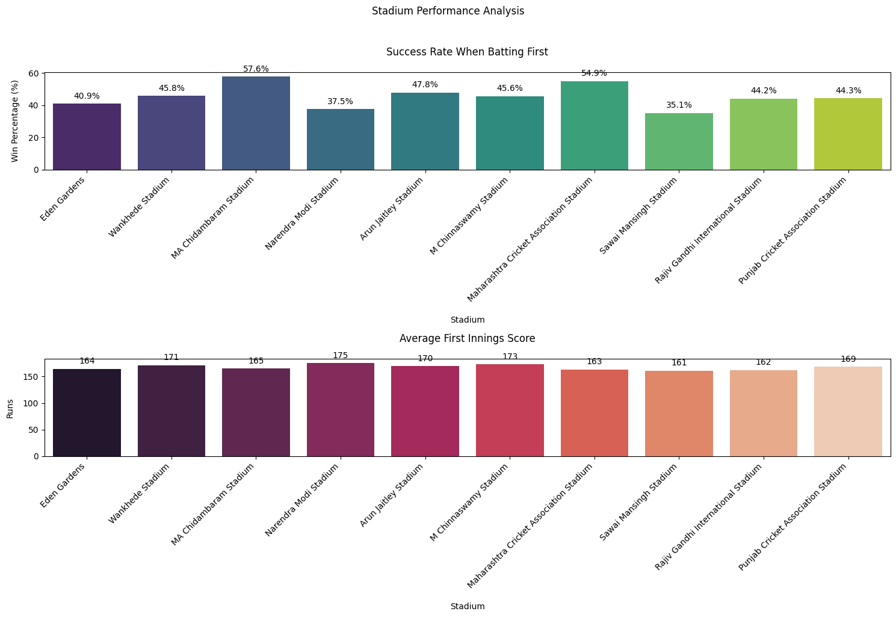

# IPL Data Analysis

This repository contains data and visualizations for analyzing IPL (Indian Premier League) matches and deliveries on a ball-by-ball basis.

## Project Overview
- **Datasets**:
  - `deliveries.csv`: Contains ball-by-ball details of IPL matches.
  - `matches.csv`: Includes match-level details such as venue, teams, and results.
- **Visualizations**: Various insights generated through graphs and charts.

---

## Visualizations

   
  
  
  
  
